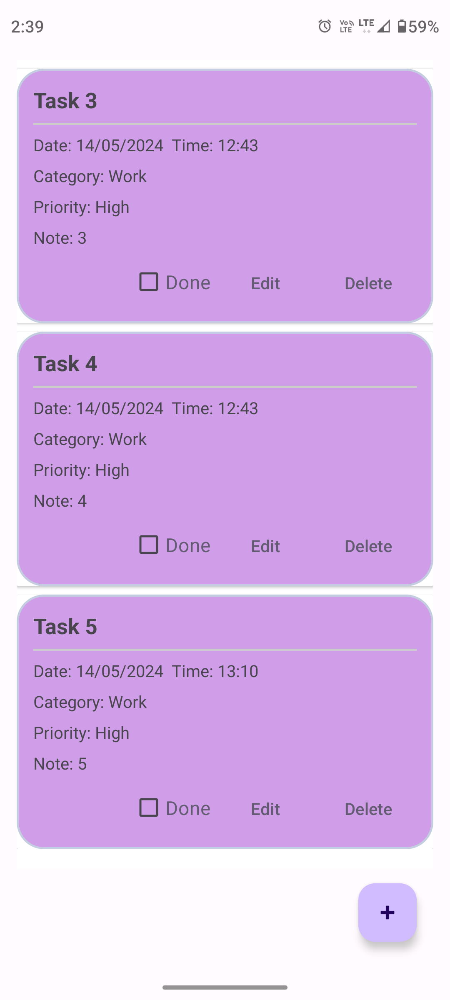
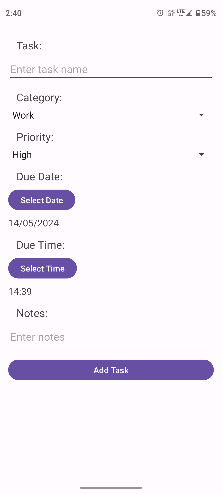
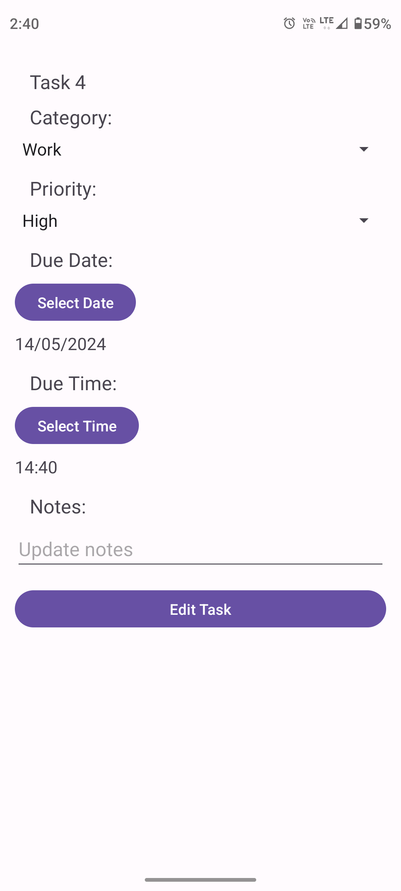

# EMSIProject_TODOLIST

A simple task management application that allows users to efficiently organize and track their tasks.

## 🌍 Languages | Langues

- [English](#english)
- [Français](#français)

---

<a name="english"></a>
# 📝 To-Do List Application

A simple **To-Do List** application that allows users to efficiently manage their tasks. This application enables users to create, categorize, and prioritize tasks with due dates and times. The application is developed for Android using Java and SQLite for local data storage.

## ✨ Features

### Core Features
- **Task Creation**: Add tasks with title, description, due date, time, category, and priority level
- **Task Categories**: Assign tasks to predefined categories for better organization
- **Due Date and Time**: Select due dates and times using date and time pickers
- **Task Completion**: Mark tasks as complete once they are finished
- **Task Notes**: Add additional notes to each task for more details

## 🛠️ Technologies Used

- **Android SDK**: For building the mobile application
- **SQLite**: For storing tasks in a local database
- **Java**: Language used for application logic
- **XML**: For designing the user interface

## 📥 Installation and Setup

### Clone the Repository
Clone the repository to your local machine:

```bash
git clone https://github.com/yourusername/EMSIProject_TODOLIST.git
```

### Build and Run the Application
1. Open the project in Android Studio
2. Click Run (Shift + F10) to build and deploy the app on an emulator or physical device
3. Select a virtual device or connect a physical device to run the application

### Prerequisites
- **Android Studio**: Make sure you have Android Studio installed on your machine
- **Android Emulator**: You can use the Android Emulator or connect a physical device for testing

## 🗄️ Database Structure

The application uses an SQLite database to store tasks locally. Here is the database schema:

### Tasks Table

| Column Name | Type    | Description                    |
|-------------|---------|--------------------------------|
| id          | INTEGER | Primary Key, Auto Increment    |
| task        | TEXT    | Task Name                      |
| category    | TEXT    | Task Category                  |
| priority    | TEXT    | Task Priority                  |
| notes       | TEXT    | Additional Notes               |
| due_date    | TEXT    | Due Date                       |
| due_time    | TEXT    | Due Time                       |
| completed   | INTEGER | Completion Status (0/1)        |

## 🤝 Contributing

1. Fork the repository
2. Create a new branch (`git checkout -b feature-branch`)
3. Commit your changes (`git commit -am 'Add new feature'`)
4. Push the branch (`git push origin feature-branch`)
5. Create a new pull request

## 📄 License

This project is licensed under the MIT License - see the LICENSE file for details.

---

<a name="français"></a>
# 📝 Application Liste de Tâches

Une application simple de **Liste de Tâches** qui permet aux utilisateurs de gérer efficacement leurs tâches. Cette application permet aux utilisateurs de créer, catégoriser et prioriser les tâches avec des dates et heures d'échéance. L'application est développée pour Android en utilisant Java et SQLite pour le stockage local des données.

## ✨ Fonctionnalités

### Fonctionnalités principales
- **Création de tâches** : Les utilisateurs peuvent ajouter des tâches avec un titre, une description, une date d'échéance, une heure d'échéance, une catégorie et un niveau de priorité
- **Catégories de tâches** : Les tâches peuvent être assignées à des catégories prédéfinies pour une meilleure organisation
- **Date et Heure d'échéance** : Les utilisateurs peuvent sélectionner une date et une heure d'échéance à l'aide de sélecteurs de date et d'heure
- **Complétion des tâches** : Marquer les tâches comme complètes une fois qu'elles sont terminées
- **Notes sur les tâches** : Ajouter des notes supplémentaires à chaque tâche pour plus de détails

## 🛠️ Technologies Utilisées

- **Android SDK** : Pour construire l'application mobile
- **SQLite** : Pour stocker les tâches dans une base de données locale
- **Java** : Langage utilisé pour la logique de l'application
- **XML** : Pour concevoir l'interface utilisateur de l'application

## 📥 Installation et Configuration

### Cloner le Répertoire
Clonez le répertoire sur votre machine locale :

```bash
git clone https://github.com/votreutilisateur/EMSIProject_TODOLIST.git
```

### Construire et Exécuter l'Application
1. Ouvrez le projet dans Android Studio
2. Cliquez sur Exécuter (Shift + F10) pour construire et déployer l'application sur un émulateur ou un appareil physique
3. Sélectionnez un appareil virtuel ou connectez un appareil physique pour exécuter l'application

### Prérequis
- **Android Studio** : Assurez-vous d'avoir Android Studio installé sur votre machine
- **Émulateur Android** : Vous pouvez utiliser l'Émulateur Android ou connecter un appareil physique pour tester

## 🗄️ Structure de la Base de Données

L'application utilise une base de données SQLite pour stocker les tâches localement. Voici le schéma de la base de données :

### Table des Tâches

| Nom de la colonne | Type    | Description                     |
|-------------------|---------|----------------------------------|
| id                | INTEGER | Clé primaire, auto-incrément     |
| task              | TEXT    | Nom de la tâche                  |
| category          | TEXT    | Catégorie de la tâche            |
| priority          | TEXT    | Priorité de la tâche             |
| notes             | TEXT    | Notes supplémentaires            |
| due_date          | TEXT    | Date d'échéance                  |
| due_time          | TEXT    | Heure d'échéance                 |
| completed         | INTEGER | Statut de complétion (0/1)       |

## 🤝 Contribuer

1. Forkez le répertoire
2. Créez une nouvelle branche (`git checkout -b branche-fonctionnalité`)
3. Commitez vos changements (`git commit -am 'Ajout de la nouvelle fonctionnalité'`)
4. Poussez la branche (`git push origin branche-fonctionnalité`)
5. Créez une nouvelle pull request

## 📄 Licence

Ce projet est sous la licence MIT - consultez le fichier LICENSE pour plus de détails.

## Screenshots



